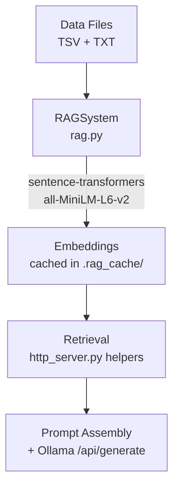

# RAG System Analysis — MKMChat

## How the RAG System Works Today

The RAG pipeline has four layers:



### 1. Indexing ([rag.py](file:///c:/Users/admin/mkmchat-mcp/mkmchat/data/rag.py))
- Reads [characters.tsv](file:///c:/Users/admin/mkmchat-mcp/mkmchat/data/characters.tsv), [abilities.tsv](file:///c:/Users/admin/mkmchat-mcp/mkmchat/data/abilities.tsv), [passives.tsv](file:///c:/Users/admin/mkmchat-mcp/mkmchat/data/passives.tsv) → one [Document](file:///c:/Users/admin/mkmchat-mcp/mkmchat/data/rag.py#32-43) per character.
- Reads [equipment_basic.tsv](file:///c:/Users/admin/mkmchat-mcp/mkmchat/data/equipment_basic.tsv), [equipment_towers.tsv](file:///c:/Users/admin/mkmchat-mcp/mkmchat/data/equipment_towers.tsv) → one [Document](file:///c:/Users/admin/mkmchat-mcp/mkmchat/data/rag.py#32-43) per equipment piece.
- Reads [gameplay.txt](file:///c:/Users/admin/mkmchat-mcp/mkmchat/data/gameplay.txt) → split on `\n\n` into section chunks.
- Reads [glossary.txt](file:///c:/Users/admin/mkmchat-mcp/mkmchat/data/glossary.txt) → split on `\n\n` into term chunks.
- Generates embeddings via `all-MiniLM-L6-v2`; caches to disk with an MD5 hash guard.

### 2. Retrieval ([http_server.py](file:///c:/Users/admin/mkmchat-mcp/mkmchat/http_server.py))
- **Variant-aware search**: generates Klassic↔Classic spelling variants, deduplicates.
- **Lexical boosting**: exact or partial name matches on character documents get boosted scores (~0.93–0.995).
- **Per-type helpers**: [build_chat_context()](file:///c:/Users/admin/mkmchat-mcp/mkmchat/http_server.py#288-371) for chat, [build_structured_context()](file:///c:/Users/admin/mkmchat-mcp/mkmchat/http_server.py#472-603) for team/ask, [_build_mechanic_rag_context()](file:///c:/Users/admin/mkmchat-mcp/mkmchat/llm/ollama.py#423-529) for mechanic explanation.

### 3. Prompt Assembly
Four distinct endpoints inject RAG context into prompts:

| Endpoint | Function | Prompt Style |
|---|---|---|
| `/api/team-suggest` | [suggest_team_json()](file:///c:/Users/admin/mkmchat-mcp/mkmchat/http_server.py#605-931) | system + user, `format: "json"` |
| `/api/ask` | [ask_question_json()](file:///c:/Users/admin/mkmchat-mcp/mkmchat/http_server.py#933-1014) | system + user, free-form Markdown |
| `/api/chat` | [chat_json()](file:///c:/Users/admin/mkmchat-mcp/mkmchat/http_server.py#1054-1166) | system (w/ history + summary) + user |
| `/api/explain-mechanic` | [explain_mechanic_json()](file:///c:/Users/admin/mkmchat-mcp/mkmchat/http_server.py#1016-1052) | system + user, `format: "json"` |

### 4. LLM ([ollama.py](file:///c:/Users/admin/mkmchat-mcp/mkmchat/llm/ollama.py))
- [OllamaAssistant](file:///c:/Users/admin/mkmchat-mcp/mkmchat/llm/ollama.py#31-783) singleton talks to Ollama's `/api/generate` (non-streaming).
- Model resolution with tag fallback (`deepseek-r1` → `deepseek-r1:latest`).
- `keep_alive: 0` on structured endpoints to reset context between requests.

---

## Bugs & Issues Found

### 🐛 BUG 1 — [equipment_krypt.tsv](file:///c:/Users/admin/mkmchat-mcp/mkmchat/data/equipment_krypt.tsv) is **never indexed** by RAG

> [!CAUTION]
> This is likely the most impactful bug.

[DataLoader.load_equipment()](file:///c:/Users/admin/mkmchat-mcp/mkmchat/data/loader.py#L153-L178) loads **three** equipment files:
- [equipment_basic.tsv](file:///c:/Users/admin/mkmchat-mcp/mkmchat/data/equipment_basic.tsv)
- [equipment_krypt.tsv](file:///c:/Users/admin/mkmchat-mcp/mkmchat/data/equipment_krypt.tsv) ← loaded here
- [equipment_towers.tsv](file:///c:/Users/admin/mkmchat-mcp/mkmchat/data/equipment_towers.tsv)

But [RAGSystem._index_equipment()](file:///c:/Users/admin/mkmchat-mcp/mkmchat/data/rag.py#L253-L304) only indexes **two**:
- [equipment_basic.tsv](file:///c:/Users/admin/mkmchat-mcp/mkmchat/data/equipment_basic.tsv)
- [equipment_towers.tsv](file:///c:/Users/admin/mkmchat-mcp/mkmchat/data/equipment_towers.tsv)

**[equipment_krypt.tsv](file:///c:/Users/admin/mkmchat-mcp/mkmchat/data/equipment_krypt.tsv) (32 items, 14 KB) is completely invisible to all RAG-powered endpoints.** This file contains high-tier character-specific equipment (S+/S tier Krypt pieces for Noob Saibot, Sub-Zero, Spawn, Rain, etc.) that will never appear in team suggestions, equipment searches, or mechanic explanations.

**Fix:** Add `self.data_dir / "equipment_krypt.tsv"` to the `equipment_files` list in [_index_equipment()](file:///c:/Users/admin/mkmchat-mcp/mkmchat/data/rag.py#253-305).

---

### 🐛 BUG 2 — [_get_relevant_context()](file:///c:/Users/admin/mkmchat-mcp/mkmchat/llm/ollama.py#186-226) uses hardcoded character names for keyword matching

In [ollama.py L212](file:///c:/Users/admin/mkmchat-mcp/mkmchat/llm/ollama.py#L212):
```python
if any(word in query_lower for word in ["character", "fighter", "scorpion", "sub-zero", "raiden", "liu kang"]):
```

This only triggers supplemental character data for 4 hardcoded names. Any other character query (e.g., "tell me about Noob Saibot") won't trigger the [DataLoader](file:///c:/Users/admin/mkmchat-mcp/mkmchat/data/loader.py#12-543) supplement. This method is also only used by the legacy [query()](file:///c:/Users/admin/mkmchat-mcp/mkmchat/llm/ollama.py#227-296) method (not the newer JSON endpoints), so its impact is limited, but it's still incorrect.

---

### 🐛 BUG 3 — [OllamaAssistant](file:///c:/Users/admin/mkmchat-mcp/mkmchat/llm/ollama.py#31-783) singleton **ignores later RAG systems**

[get_ollama_assistant()](file:///c:/Users/admin/mkmchat-mcp/mkmchat/llm/ollama.py#L789-L796) creates the singleton on first call and never updates it:
```python
def get_ollama_assistant(rag_system=None):
    global _ollama_assistant
    if _ollama_assistant is None:
        _ollama_assistant = OllamaAssistant(rag_system=rag_system)
    return _ollama_assistant
```

If the first caller passes `rag_system=None`, **all subsequent calls with a valid RAG system are silently ignored**. The http_server endpoints do pass it correctly, but if the MCP server or test code initializes first without RAG, the assistant will permanently lack RAG.

---

### ⚠️ ISSUE 4 — [_get_relevant_context()](file:///c:/Users/admin/mkmchat-mcp/mkmchat/llm/ollama.py#186-226) uses [_characters](file:///c:/Users/admin/mkmchat-mcp/mkmchat/data/loader.py#38-62) internal dict

In [ollama.py L216](file:///c:/Users/admin/mkmchat-mcp/mkmchat/llm/ollama.py#L216):
```python
chars = list(self.data_loader._characters.values())[:10]
```

This accesses a private attribute on [DataLoader](file:///c:/Users/admin/mkmchat-mcp/mkmchat/data/loader.py#12-543). If the internal structure changes, this silently breaks. Should use `self.data_loader.get_all_characters()[:10]` instead.

---

### ⚠️ ISSUE 5 — Cosine similarity is computed with `np.dot()` only (no normalization check)

In [rag.py L378](file:///c:/Users/admin/mkmchat-mcp/mkmchat/data/rag.py#L378):
```python
similarities = np.dot(self.embeddings, query_embedding)
```

This uses dot product instead of cosine similarity. `all-MiniLM-L6-v2` **does** produce L2-normalized embeddings, so dot product ≈ cosine similarity in practice. However, if the model is ever changed, this will silently produce incorrect scores. A normalization step or explicit cosine would be more robust.

---

### ⚠️ ISSUE 6 — Gameplay/glossary chunking is too naive

[rag.py](file:///c:/Users/admin/mkmchat-mcp/mkmchat/data/rag.py#L306-L346) splits gameplay and glossary on `\n\n`. Looking at the actual files:

- [gameplay.txt](file:///c:/Users/admin/mkmchat-mcp/mkmchat/data/gameplay.txt) has **no blank lines** between most entries — it's mostly single-spaced. This means the entire file may become **one giant chunk**, making semantic search ineffective (the embedding is too broad to match specific queries).
- [glossary.txt](file:///c:/Users/admin/mkmchat-mcp/mkmchat/data/glossary.txt) uses `\n\n` between sections but individual terms within a section have **no blank line** separators. An entire section like `== DEBUFFS ==` (20+ terms) becomes a single chunk.

**Result:** Searches for specific mechanics like "Oblivion" or "Snare" get a fat chunk with many unrelated terms instead of a precise match.

---

## Improvement Suggestions

### 1. Fix [equipment_krypt.tsv](file:///c:/Users/admin/mkmchat-mcp/mkmchat/data/equipment_krypt.tsv) indexing (Critical)

Add the missing file to [_index_equipment()](file:///c:/Users/admin/mkmchat-mcp/mkmchat/data/rag.py#253-305). This is a one-line fix with high impact — 32 pieces of high-tier equipment become discoverable.

### 2. Improve gameplay/glossary chunking

- **Gameplay:** Split on single newlines (`\n`) and create one document per line/paragraph instead of on `\n\n`.
- **Glossary:** Split on individual term definitions (lines matching `Name: Definition`) rather than on double newlines. Each term should be its own document for precise retrieval.

### 3. Add structured metadata to gameplay/glossary documents

Currently gameplay chunks get `metadata={'section': i}` (just an index) and glossary chunks get `metadata={}` (empty). Adding descriptive metadata (e.g., `{'topic': 'tag-in'}`, `{'term': 'Snare', 'category': 'DEBUFFS'}`) would enable filtered searches and improve result quality.

### 4. Consider hybrid retrieval (semantic + BM25/keyword)

The current system relies entirely on embedding similarity, with a bolted-on lexical boost only for character names. A proper hybrid approach (e.g., using `rank_bm25` or simple TF-IDF alongside embeddings) would greatly improve recall for exact game terms like "Fracture", "Oblivion", or "{{Brutality}}".

### 5. Pre-filter RAG context by query intent

The system currently searches **all** document types and stuffs everything into the prompt. For a question like "What does Snare do?", the LLM gets 8 character matches and 10 equipment matches alongside the relevant glossary entry. A simple intent classifier (keyword-based) could skip irrelevant doc types:
- Questions with "what is" / "how does" → prioritize gameplay + glossary
- Questions with character names → prioritize characters
- Questions with "best equipment" → prioritize equipment

### 6. Fix the singleton pattern for [OllamaAssistant](file:///c:/Users/admin/mkmchat-mcp/mkmchat/llm/ollama.py#31-783)

Either update the singleton to accept a new RAG system if one is provided, or initialize it lazily with the RAG system always present:
```python
def get_ollama_assistant(rag_system=None):
    global _ollama_assistant
    if _ollama_assistant is None:
        _ollama_assistant = OllamaAssistant(rag_system=rag_system)
    elif rag_system is not None and _ollama_assistant.rag_system is None:
        _ollama_assistant.rag_system = rag_system
    return _ollama_assistant
```

### 7. Add a `synergy` field to character document content

[Character indexing](file:///c:/Users/admin/mkmchat-mcp/mkmchat/data/rag.py#L215-L216) includes synergy in the content but **only if the field is non-empty**. The synergy value is also stored in metadata, but the content embedding doesn't always reflect it. For team suggestions, synergy is crucial — consider always including `Synergy: None` as a signal even when empty.

### 8. Reduce prompt size for small models

For 3B models like `llama3.2:3b`, the current prompts can exceed 4000+ tokens of RAG context. This leaves little room for reasoning. Consider:
- Dynamically adjusting `top_k` and `max_chars` based on model size.
- More aggressively truncating equipment effects in the structured context.
- Using the env vars (`MKM_TEAM_CHAR_LIMIT`, etc.) with lower defaults for small models.

---

## Summary

| Priority | Issue | Impact |
|---|---|---|
| 🔴 Critical | Krypt equipment not indexed | 32 items invisible to all RAG endpoints |
| 🟠 High | Naive gameplay/glossary chunking | Poor retrieval precision for mechanics questions |
| 🟡 Medium | Singleton ignores late RAG systems | Potential silent RAG loss |
| 🟡 Medium | Missing hybrid retrieval | Exact game-term searches underperform |
| 🟢 Low | Hardcoded character names in fallback | Minor, only affects legacy endpoint |
| 🟢 Low | Dot product vs. cosine | No current impact, future risk |
